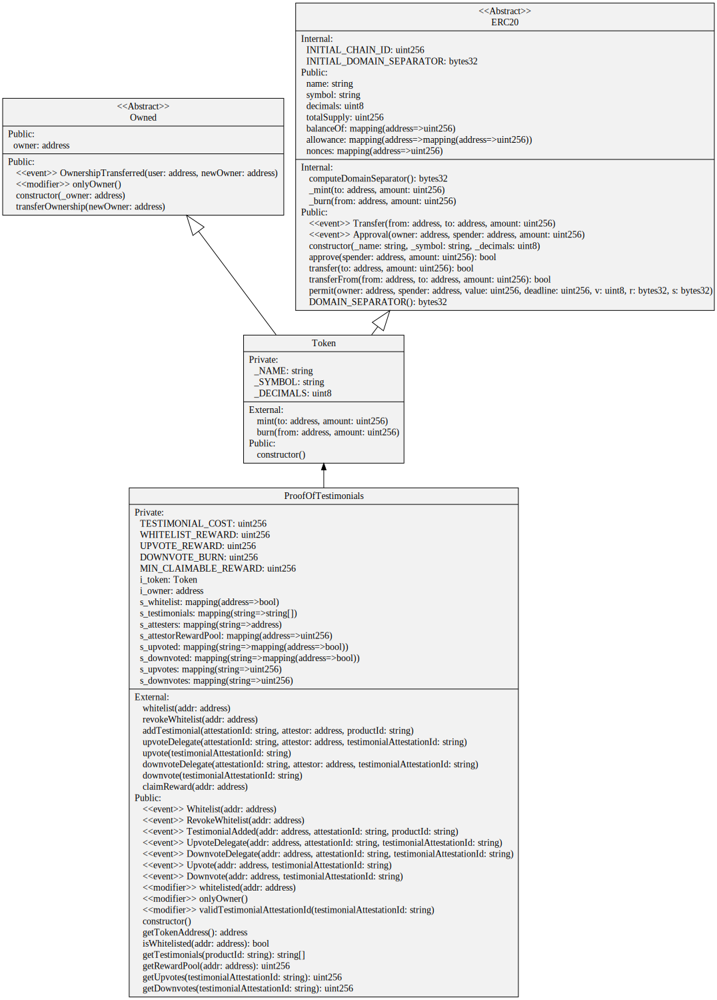

## Requirements

- `Git`
- `Foundry`
- `jq` ( Requirement for [Foundry DevOps](https://github.com/Cyfrin/foundry-devops) )
- `make` ( Optional )

## Deployment

Neon Devnet Conract Address: [0x3311c551E1F45A2DD7f072ef0a8f2406DE7058bF](https://neon-devnet.blockscout.com/address/0x1028FE36D0AFe0cf1f9603E7165c0476c85eEcfe?tab=contact_code)

Gnosis Chiado Conract Address: [0x0fADd2245E62e3031bD8D05855278b3F6F68dC77](https://gnosis-chiado.blockscout.com/address/0x0fADd2245E62e3031bD8D05855278b3F6F68dC77?tab=contract)

## Architecture

<!-- Add svg from assets folder -->

